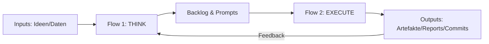

# OMNIKAI – Projektüberblick

OMNIKAI ist ein modularer Multi‑Agenten‑Stack. Steuer‑KI: **Claude**. Unterstützend: **Gemini** (Deep Research) und **Grok** (Red‑Team/Trendcheck).  
Orchestrierung über zwei gekoppelte n8n‑Flows: **Think** (Struktur) → **Execute** (Umsetzung).

## Architektur


## Profitability Engine (OPI)
Die wöchentlichen Auswertungen liegen unter `dashboards/`. Lokal lässt sich der Report mit

```bash
python tools/profit_calc.py --config profit/config.yaml --params profit/unit_economics.yaml \
  --metrics data/metrics.csv --threshold tools/opindex_threshold.json \
  --template dashboards/weekly_profit_report.md.gtpl --out dashboards/weekly_profit_report.md \
  --json dashboards/weekly_profit_report.json
```
